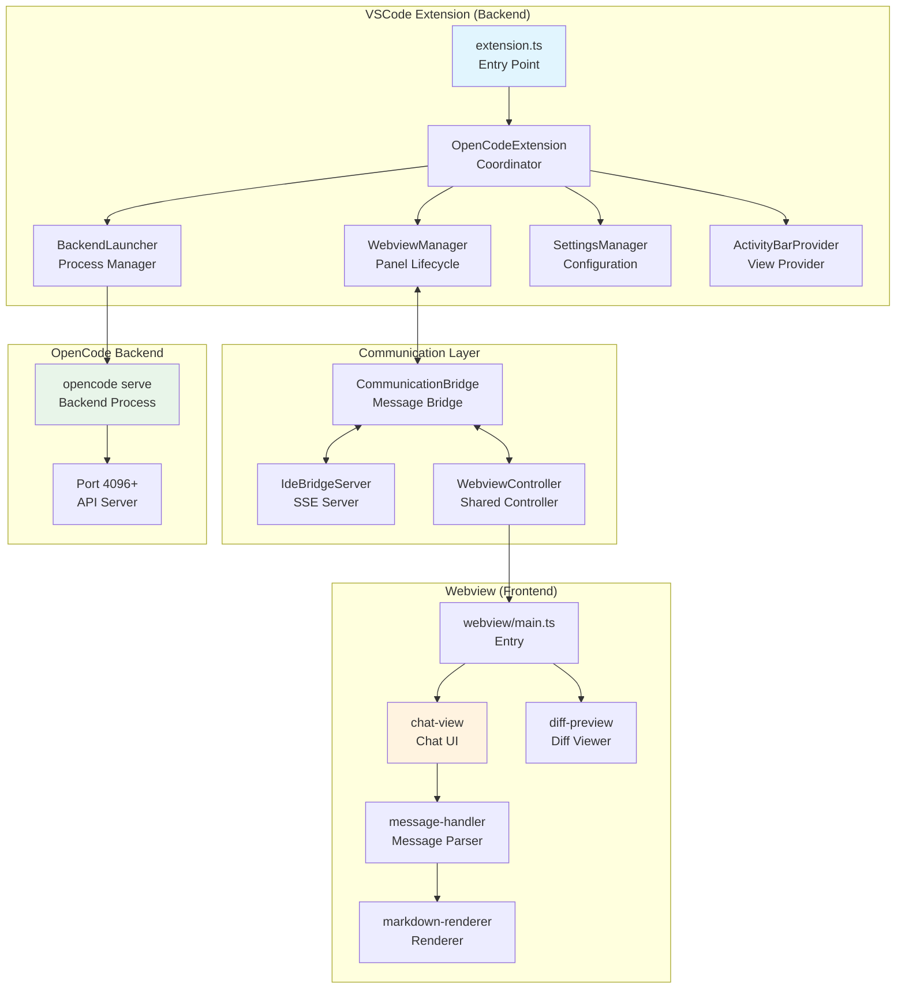
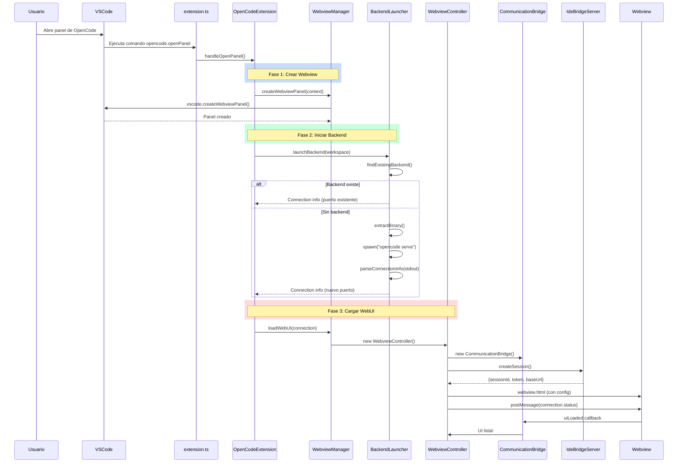
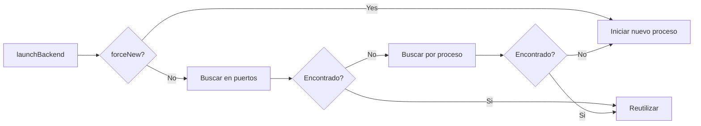
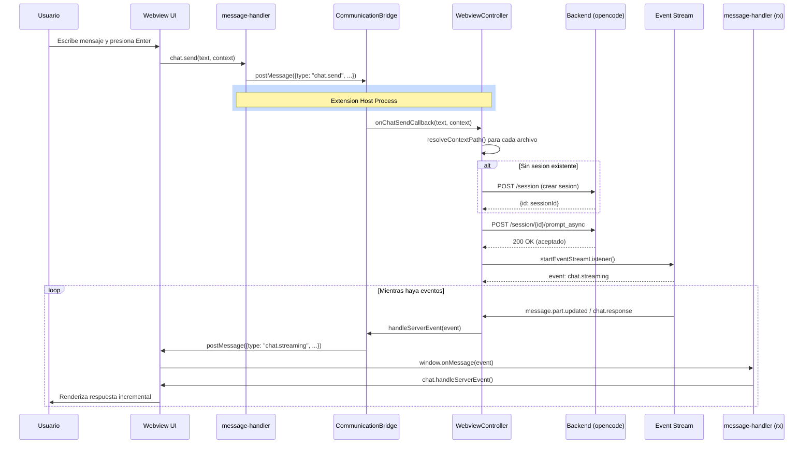
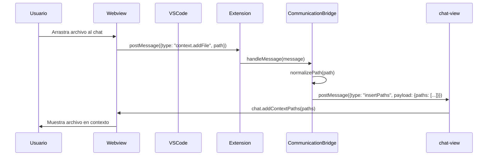
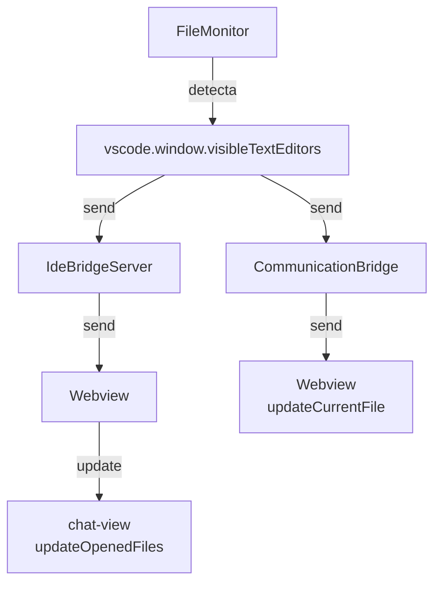
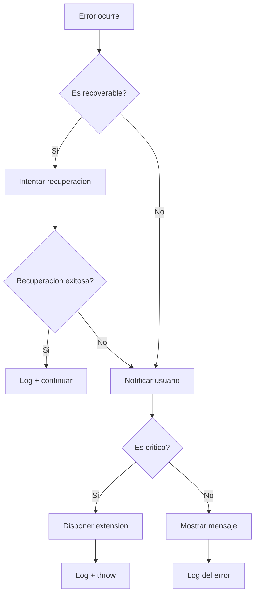

# OpenCode DragonFu - Architecture Documentation

## 1. Vision General

### 1.1 Diagrama de Arquitectura



### Architecture Layers

| Layer | Components | Responsibility |
|-------|------------|----------------|
| **Extension** | extension.ts, OpenCodeExtension | Lifecycle, coordination |
| **UI Management** | WebviewManager, WebviewController, ActivityBarProvider | Webview lifecycle, HTML generation |
| **Communication** | CommunicationBridge, IdeBridgeServer | Bidirectional messaging, SSE |
| **Backend** | BackendLauncher, ResourceExtractor | Process management, binary extraction |
| **Webview** | chat-view, diff-preview, message-handler | UI rendering, user interaction |

### 1.2 Proposito del Sistema

**OpenCode DragonFu** es una extension de Visual Studio Code que integra la CLI de OpenCode con una interfaz de usuario personalizada (tema "DragonFu"). La extension proporciona una interfaz de chat basada en webview para interactuar con el backend de OpenCode.

### 1.2 Componentes Principales

El sistema esta compuesto por tres capas principales:

```
+-------------------+     +--------------------+     +------------------+
| VSCode Extension | --> | OpenCode Backend  | --> |   Webview UI    |
|   (TypeScript)   |     |  (opencode serve) |     | (Lit Components)|
+-------------------+     +--------------------+     +------------------+
```

| Componente | Tecnologia | Descripcion |
|------------|------------|-------------|
| Extension Host | Node.js + TypeScript | Maneja el ciclo de vida de la extension, comandos, y coordinacion |
| Backend | opencode serve (CLI) | Proceso separado que expone API REST y SSE |
| Webview | Lit + TypeScript | Interfaz de usuario en el panel lateral de VSCode |

### 1.3 Flujo de Datos Simplificado

1. **Usuario** interactua con el **Webview** (envia mensaje)
2. **Webview** envia mensaje a **CommunicationBridge** (via postMessage)
3. **CommunicationBridge** reenvia a **WebviewController**
4. **WebviewController** hace POST a **Backend API** (`/session/{id}/prompt_async`)
5. **Backend** procesa y emite eventos via **SSE** (Server-Sent Events)
6. **WebviewController** recibe eventos y reenvia al **Webview**
7. **Webview** renderiza la respuesta

### 1.4 Caracteristicas Clave

- **Comunicacion bidireccional**: Extension <-> Webview via postMessage y SSE
- **Reutilizacion de backend**: Detecta y reutiliza instancias existentes de opencode
- **Monitoreo de archivos**: FileMonitor detecta archivos abiertos y sincroniza con el chat
- **Drag & Drop**: Arrastrar archivos al chat para agregar contexto
- **Diff Preview**: Vista previa de cambios propuestos por el agente
- **Temas**: Soporte para tema nativo y DragonFu

---

## 2. Componentes y Responsabilidades

### 2.1 Extension Layer

#### extension.ts
- **Archivo**: `src/extension.ts`
- **Responsabilidad**: Punto de entrada principal, coordina todos los componentes
- **API publica**:
  - `activate(context)`: Inicializa la extension
  - `deactivate()`: Limpia recursos
- **Dependencias**: WebviewManager, BackendLauncher, SettingsManager, ActivityBarProvider

#### OpenCodeExtension (clase)
- **Responsabilidad**: Coordenador central de componentes
- **Metodos principales**:
  - `initialize()`: Inicializa componentes core
  - `registerCommands()`: Registra comandos de VSCode
  - `handleOpenPanel()`: Abre el panel de chat
  - `dispose()`: Libera recursos

### 2.2 UI Management Layer

#### WebviewManager
- **Archivo**: `src/ui/WebviewManager.ts`
- **Responsabilidad**: Maneja el ciclo de vida del panel webview
- **Metodos**:
  - `createWebviewPanel()`: Crea el panel de webview
  - `loadWebUI()`: Carga la interfaz de usuario
  - `dispose()`: Limpia recursos
- **Nota**: Delega operaciones a WebviewController

#### WebviewController
- **Archivo**: `src/ui/WebviewController.ts`
- **Responsabilidad**: Lógica compartida entre WebviewManager y ActivityBarProvider
- **Metodos**:
  - `load()`: Inicializa bridge, HTML, eventos
  - `handleChatSend()`: Envia mensajes al backend
  - `startEventStreamListener()`: Escucha SSE del backend
  - `handleServerEvent()`: Procesa eventos entrantes

#### ActivityBarProvider
- **Archivo**: `src/ui/ActivityBarProvider.ts`
- **Responsabilidad**: Proveedor de vista para el panel lateral
- **Extiende**: `vscode.WebviewViewProvider`

### 2.3 Communication Layer

#### CommunicationBridge
- **Archivo**: `src/ui/CommunicationBridge.ts`
- **Responsabilidad**: Puente de comunicacion bidireccional VSCode <-> Webview
- **Metodos**:
  - `sendMessage()`: Envia mensajes al webview
  - `insertPaths()`: Inserta rutas de archivos al contexto
  - `handleOpenFile()`: Abre archivos desde el webview
  - `handleStateChange()`: Sincroniza cambios de configuracion
- **Mensajes soportados**: insertPaths, pastePath, chat.send, diff.show, openFile, openUrl

#### IdeBridgeServer
- **Archivo**: `src/ui/IdeBridgeServer.ts`
- **Responsabilidad**: Servidor HTTP local para SSE (Server-Sent Events)
- **Puerto**: Asignado dinamicamente (ej: 54321)
- **Endpoints**:
  - `POST /idebridge/{sessionId}`: Crear sesion
  - `GET /idebridge/{sessionId}/events`: Stream de eventos SSE

### 2.4 Backend Layer

#### BackendLauncher
- **Archivo**: `src/backend/BackendLauncher.ts`
- **Responsabilidad**: Manejo del proceso del backend de OpenCode
- **Metodos**:
  - `launchBackend()`: Inicia o reutiliza el backend
  - `findExistingBackend()`: Busca instancias en puertos conocidos (4096, 60189, etc.)
  - `extractBinary()`: Extrae el binario embebido o usa el del sistema
  - `terminate()`: Detiene el proceso
- **Puertos conocidos**: 4096 (default), 60189, 43665, 40499

#### ResourceExtractor
- **Archivo**: `src/backend/ResourceExtractor.ts`
- **Responsabilidad**: Extrae binarios embebidos en la extension

### 2.5 Settings Layer

#### SettingsManager
- **Archivo**: `src/settings/SettingsManager.ts`
- **Responsabilidad**: Gestiona configuracion de usuario
- **Configuraciones**:
  - `opencode.customCommand`: Comando personalizado
  - `opencode.context.maxFileChars`: Maximo de caracteres por archivo

### 2.6 Utilities Layer

| Utility | Archivo | Descripcion |
|---------|---------|-------------|
| ErrorHandler | `src/utils/ErrorHandler.ts` | Manejo centralizado de errores |
| FileMonitor | `src/utils/FileMonitor.ts` | Monitorea archivos abiertos |
| PathInserter | `src/utils/PathInserter.ts` | Inserta rutas desde el editor |
| PathInserter (comandos) | `src/commands/*.ts` | Comandos de menu contextual |

### 2.7 Webview Layer (Frontend)

#### chat-view
- **Archivo**: `src/webview/components/chat-view.ts`
- **Responsabilidad**: Componente principal de chat (Lit component)
- **Caracteristicas**: Input de mensaje, lista de mensajes, contexto

#### chat-message
- **Archivo**: `src/webview/components/chat-message.ts`
- **Responsabilidad**: Renderizado de mensajes individuales

#### diff-preview
- **Archivo**: `src/webview/components/diff-preview.ts`
- **Responsabilidad**: Vista previa de cambios propuestos

#### message-handler
- **Archivo**: `src/webview/utils/message-handler.ts`
- **Responsabilidad**: Procesa mensajes recibidos desde la extension

#### markdown-renderer
- **Archivo**: `src/webview/utils/markdown-renderer.ts`
- **Responsabilidad**: Renderiza Markdown con highlight.js

---

## 3. Flujo de Activacion

### 3.1 Diagrama de Secuencia - Inicializacion de la Extension



### 3.2 Pasos Detallados

#### Paso 1: Registro de Comandos
```
activate() 
  → context.subscriptions.push(commands)
  → Registra: opencode.openPanel, addFileToContext, etc.
```

#### Paso 2: Inicializacion de Componentes
```
initialize()
  → SettingsManager.initialize()
  → BackendLauncher (sin iniciar proceso aun)
  → WebviewManager (sin crear panel)
  → ActivityBarProvider.registerWebviewViewProvider()
```

#### Paso 3: Apertura del Panel
```
handleOpenPanel()
  → WebviewManager.createWebviewPanel()
    → vscode.window.createWebviewPanel()
    → setupWebviewOptions() (CSP config)
    → panel.onDidDispose() cleanup handler
  → BackendLauncher.launchBackend()
    → findExistingBackend() [puertos: 4096, 60189, 43665]
    → Si no existe: spawn("opencode serve")
    → parseConnectionInfo() [busca URL en stdout]
  → WebviewManager.loadWebUI()
    → WebviewController.load()
      → CommunicationBridge setup
      → IdeBridgeServer.createSession()
      → Genera HTML con config (backendUrl, bridgeUrl)
      → FileMonitor.startMonitoring()
```

### 3.3 Reutilizacion de Backend



**Puertos verificados**: 4096, 60189, 43665, 40499

---

## 4. Flujo de Chat

### 4.1 Diagrama de Secuencia - Envio de Mensaje



### 4.2 Diagrama de Secuencia - Recepcion de Contexto (Drag & Drop)



### 4.3 Pasos Detallados - Envio de Mensaje

#### 1. Usuario envia mensaje
```
Webview:
  chat-view.getInput()
  → messageHandler.postMessage({
      type: "chat.send",
      text: "analiza este archivo",
      context: [{type: "file", path: "src/main.ts"}]
    })
```

#### 2. Extension recibe mensaje
```
CommunicationBridge.setupMessageHandlers()
  → switch(message.type)
    case "chat.send":
      → onChatSendCallback(text, context, options)
```

#### 3. WebviewController procesa
```
WebviewController.handleChatSend()
  → resolveContextPath() [cada archivo en contexto]
  → vscode.workspace.fs.readFile() [leer contenido]
  → Truncar si excede maxFileChars (default: 50000)
  → POST /session/{id}/prompt_async
```

#### 4. Escuchar eventos SSE
```
WebviewController.startEventStreamListener()
  → http.get("/event")
  → res.on("data", handleServerEvent)
```

#### 5. Procesar eventos
```
handleServerEvent(event):
  - "message.part.updated" → chat.streaming (incremental)
  - "chat.response" / " chat.remessage.complete" →ceive (final)
```

### 4.4 FileMonitor - Archivos Abiertos



**Frecuencia de actualizacion**: En cada cambio de editorvisible

---

## 5. Protocolo de Comunicacion

### 5.1 Canales de Comunicacion

| Canal | Tipo | Descripcion |
|-------|------|-------------|
| postMessage (VSCode -> Webview) | Sincronico | Mensajes directos al webview |
| postMessage (Webview -> VSCode) | Sincronico | Comandos del usuario |
| SSE (Backend -> Extension) | Async/Streaming | Eventos del backend |
| HTTP POST (Extension -> Backend) | Request/Response | Envio de prompts |

### 5.2 Mensajes: Extension -> Webview

| Tipo | Direccion | Payload | Descripcion |
|------|-----------|---------|-------------|
| `chat.receive` | E→W | `{text: string}` | Respuesta completa del agente |
| `chat.streaming` | E→W | `{text: string}` | Chunk incremental de respuesta |
| `insertPaths` | E→W | `{paths: string[]}` | Archivos agregados al contexto |
| `pastePath` | E→W | `{path: string}` | Carpeta agregada al contexto |
| `updateOpenedFiles` | E→W | `{openedFiles: string[], currentFile?: string}` | Lista de archivos abiertos |
| `updateCurrentFile` | E→W | `{path: string, name: string}` | Archivo activo en editor |
| `connection.status` | E→W | `{connected: bool, reused: bool, port: number}` | Estado de conexion |
| `diff.show` | E→W | `{content: string, messageId?: string}` | Mostrar diff |
| `diff.close` | E→W | `{}` | Cerrar diff |
| `theme.update` | E→W | `{theme: string}` | Cambiar tema |
| `editor.selection` | E→W | `{selection: {...}}` | Seleccion actual del editor |
| `error` | E→W | `{command: string, text: string}` | Mensaje de error |

### 5.3 Mensajes: Webview -> Extension

| Tipo | Direccion | Payload | Descripcion |
|------|-----------|---------|-------------|
| `chat.send` | W→E | `{text: string, context?: [], options?: {}}` | Enviar mensaje al agente |
| `openFile` | W→E | `{path: string}` | Abrir archivo en editor |
| `openUrl` | W→E | `{url: string}` | Abrir URL en navegador |
| `context.requestFile` | W→E | `{}` | Solicitar selector de archivos |
| `context.addFile` | W→E | `{path: string}` | Agregar archivo arrastrado |
| `context.addCurrentFile` | W→E | `{}` | Agregar archivo activo |
| `editor.getSelection` | W→E | `{}` | Obtener seleccion actual |
| `settingsChanged` | W→E | `{key: string, value: any}` | Cambiar configuracion |
| `diff.applyCode` | W→E | `{code: string, fileName: string}` | Aplicar cambios (pendiente) |
| `uiLoaded` | W→E | `{success: bool, error?: string}` | UI cargada |

### 5.4 Eventos SSE (Backend -> Extension)

| Evento | Datos | Descripcion |
|--------|-------|-------------|
| `message.part.updated` | `{properties: {part, delta}}` | Chunk de respuesta incremental |
| `chat.streaming` | `{text: string}` | Respuesta en streaming |
| `chat.response` | `{text: string}` | Respuesta completa |
| `message.complete` | `{content: string}` | Mensaje completado |
| `message.updated` | `{...}` | Metadata actualizada |

### 5.5 API del Backend (HTTP)

| Metodo | Endpoint | Descripcion |
|--------|----------|-------------|
| GET | `/session` | Listar sesiones existentes |
| POST | `/session` | Crear nueva sesion |
| GET | `/session/{id}` | Obtener sesion por ID |
| POST | `/session/{id}/prompt_async` | Enviar prompt (async) |
| GET | `/event` | Server-Sent Events stream |

---

## 6. Manejo de Errores

### 6.1 Sistema Centralizado

La extension usa **ErrorHandler** (`src/utils/ErrorHandler.ts`) como sistema centralizado de manejo de errores.

```typescript
// Pattern de uso
try {
  // ... operacion
} catch (error) {
  await errorHandler.handleError(
    errorHandler.createErrorContext(
      ErrorCategory.COMMAND_EXECUTION,
      ErrorSeverity.ERROR,
      "NombreClase",
      "nombreMetodo",
      error instanceof Error ? error : new Error(String(error)),
      { contexto: "adicional" }
    )
  )
}
```

### 6.2 Categorias de Errores

| Categoria | Descripcion | Componentes asociados |
|-----------|-------------|----------------------|
| `BACKEND_LAUNCH` | Error al iniciar el proceso de OpenCode | BackendLauncher |
| `WEBVIEW_LOAD` | Error al cargar el webview | WebviewManager, WebviewController |
| `COMMUNICATION` | Error en la comunicacion entre componentes | CommunicationBridge |
| `FILE_OPERATION` | Error al leer/escribir archivos | PathInserter, comandos |
| `SETTINGS` | Error de configuracion | SettingsManager |
| `COMMAND_EXECUTION` | Error al ejecutar comandos | extension.ts |
| `RESOURCE_EXTRACTION` | Error al extraer binarios | ResourceExtractor |
| `NETWORK` | Error de red | BackendLauncher |
| `PERMISSION` | Error de permisos | BackendLauncher |
| `VALIDATION` | Error de validacion | Varios |

### 6.3 Niveles de Severidad

| Nivel | Accion | Descripcion |
|-------|--------|-------------|
| `INFO` | Log only | Informacion general |
| `WARNING` | Log + notificacion | Advertencia, operacion puede continuar |
| `ERROR` | Log + notificacion | Error grave, operacion fallida |
| `CRITICAL` | Log + notificacion + disposicion | Error critico, puede disposing extension |

### 6.4 Flujo de Errores



### 6.5 Manejo Especifico por Componente

#### BackendLauncher
- **Errores comunes**:
  - Binario no encontrado → Buscar en PATH o mostrar instalacion
  - Puerto en uso → Probar siguiente puerto
  - Timeout → Reintentar o fallback
- **Recuperacion**: Intentar puertos alternativos, fallback sin custom command

#### WebviewController
- **Errores comunes**:
  - Error al conectar a SSE → Mostrar error de conexion
  - Timeout en API → Notificar al usuario
- **Recuperacion**: Reintentar conexion

#### CommunicationBridge
- **Errores comunes**:
  - Error al enviar mensaje → Loggear, continuar
  - Error al recibir mensaje → Ignorar mensaje problematico

### 6.6 Diagnosticos

El sistema proporciona un comando `opencode.showDiagnostics` que muestra:
- Version de la extension
- Version de VSCode
- Plataforma y arquitectura
- Informacion del workspace
- Configuracion actual
- Errores recientes

---

## 7. Decisiones de Diseño

### 7.1 Por que WebviewController compartido?

WebviewController es usado por ambos:
- **WebviewManager**: Panel en editor (tab)
- **ActivityBarProvider**: Panel lateral

Esto evita duplicacion de logica de inicializacion y mantiene consistencia.

### 7.2 CSP Configuration

La politica de seguridad de contenido permite:
- Scripts: `unsafe-inline`, `unsafe-eval` desde extension y 127.0.0.1
- Estilos: `unsafe-inline` desde extension
- Conexiones: WebSocket y HTTP desde localhost
- Imagenes: data URIs y vscode-cdn.net

### 7.3 Reutilizacion de Backend

El backend se reutiliza para:
- Evitar multiples procesos de OpenCode
- Compartir estado entre sesiones
- Mejorar rendimiento

**Ultima actualizacion:** Documento creado desde codigo fuente


